# AWS Lab: Static Website Hosting with Amazon S3

> **Plataforma:** AWS Skill Builder — Cloud Computing Essentials 
> **Dificultad:** Principiante 
> **Servicios utilizados:** Amazon S3 
> **Tiempo estimado:** ~30 minutos

---

## Descripción

En este laboratorio práctico se configura un **sitio web estático** utilizando **Amazon S3**, uno de los servicios de almacenamiento en la nube más utilizados de AWS. El escenario simula una solicitud real: migrar el portal web de una ciudad a S3 para mejorar su fiabilidad y disponibilidad.

### Objetivos del laboratorio

- Habilitar el alojamiento de sitios web estáticos en un bucket de Amazon S3.
- Revisar la política del bucket para asegurar el acceso público de solo lectura.
- (DIY) Renombrar el archivo `index.html` a `waves.html`.

### Arquitectura de la solución

```
Ciudad (usuarios) → Portal web → Amazon S3 Bucket → Bucket Policy
```

Los residentes acceden al portal web de la ciudad, cuyo contenido estático está alojado en un bucket S3 protegido mediante una política de bucket que permite únicamente operaciones `GetObject` de forma pública.

---

## ️ Pasos realizados

### 1. Acceso a Amazon S3

Desde la consola de AWS, se buscó el servicio **S3** en la barra de búsqueda y se accedió al panel de **Buckets de uso general**.

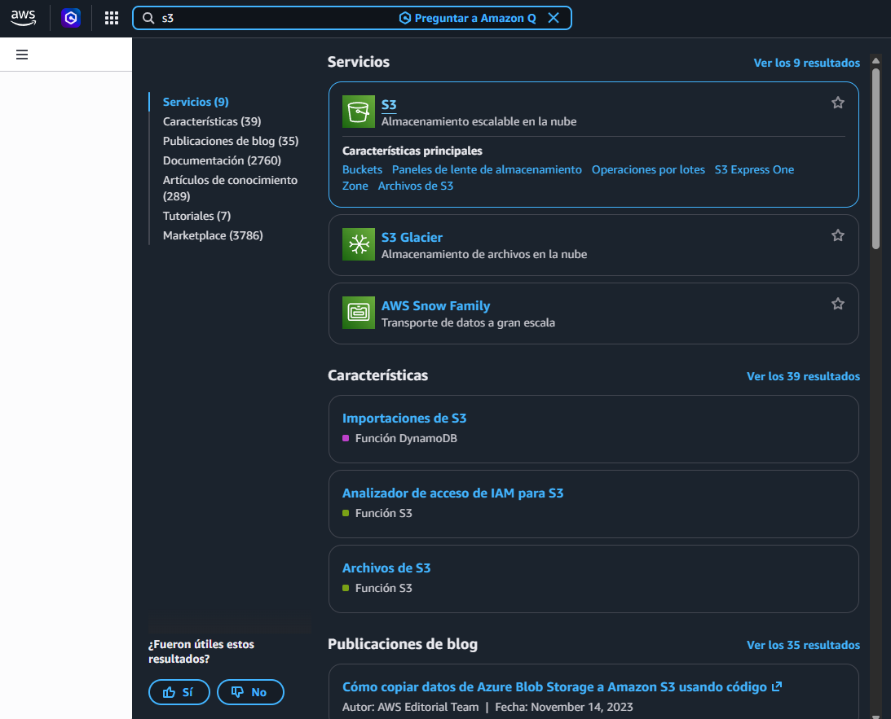

---

### 2. Identificación del bucket objetivo

En la lista de buckets se localizó el bucket con prefijo `website-bucket-`, creado automáticamente por el laboratorio.

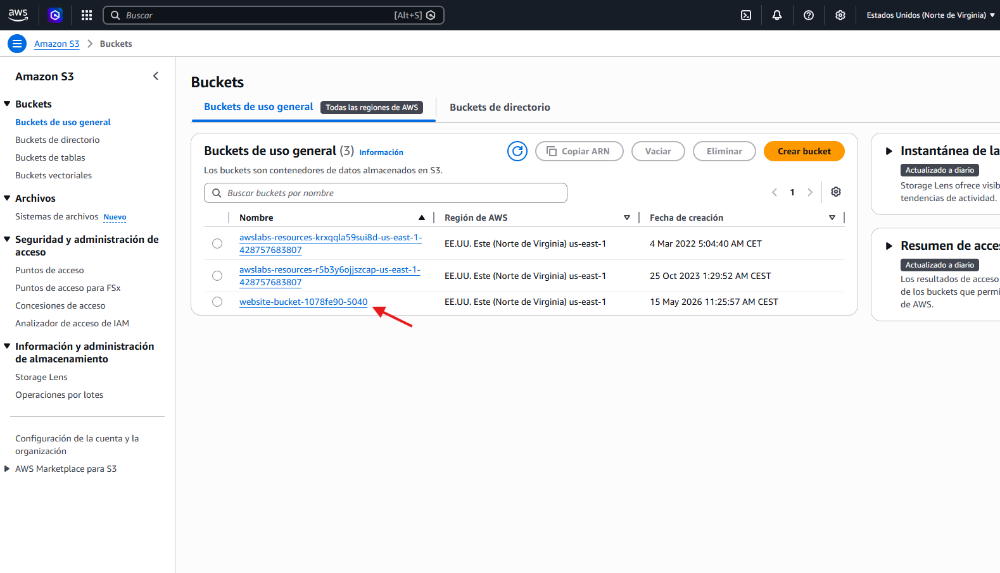

---

### 3. Exploración del contenido del bucket

Dentro del bucket se encontraron los siguientes objetos:

| Archivo | Tipo |
|---|---|
| `index.html` | HTML — página principal |
| `main.js` | JavaScript |
| `styles.css` | CSS |
| `target-file.csv` | CSV |
| `text.html` | HTML |

---

### 4. Renombrar `text.html` a `error.html`

Para configurar correctamente el alojamiento estático, se necesitaba un documento de error. Usando el menú **Acciones → Cambiar el nombre del objeto**, se renombró `text.html` a `error.html`.

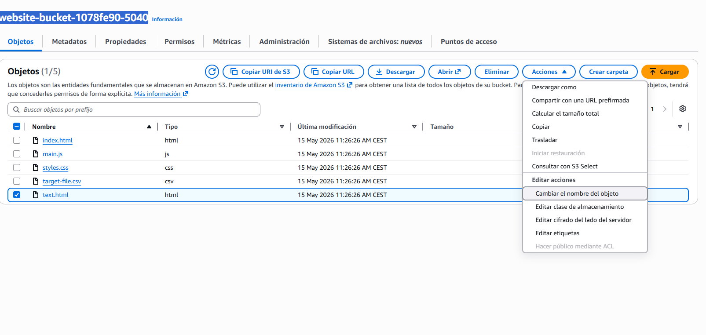

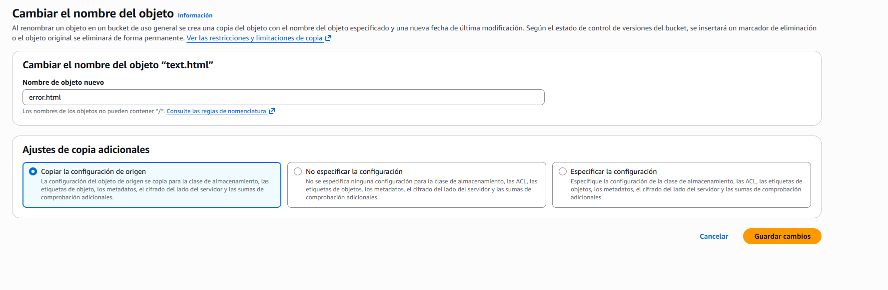

---

### 5. Revisión de permisos del bucket

En la pestaña **Permisos** se verificaron dos configuraciones clave:

**Bloqueo de acceso público:** desactivado (necesario para que el sitio sea accesible públicamente).

**Política del bucket** (JSON):

```json
{
"Version": "2012-10-17",
"Id": "StaticWebPolicy",
"Statement": [
{
"Sid": "S3GetObjectAllow",
"Effect": "Allow",
"Principal": "*",
"Action": "s3:GetObject",
"Resource": "arn:aws:s3:::website-bucket-1078fe90-5040/*"
}
]
}
```

Esta política permite que **cualquier usuario** (`"Principal": "*"`) pueda leer (`s3:GetObject`) todos los objetos del bucket. Es el mínimo necesario para un sitio web estático público.

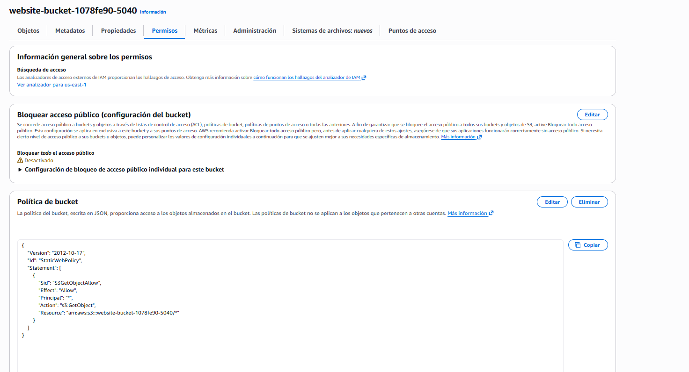

---

### 6. Cifrado predeterminado

Se verificó que el bucket utiliza cifrado **SSE-S3** (Server-Side Encryption con claves administradas por Amazon S3), lo que garantiza que los objetos almacenados están cifrados en reposo.

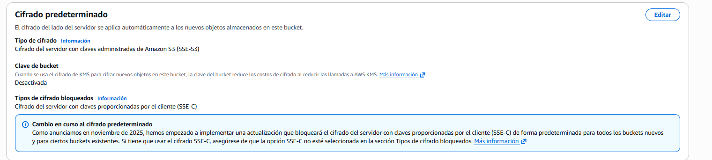

---

### 7. Habilitación del alojamiento de sitios web estáticos

En la pestaña **Propiedades**, sección **Alojamiento de sitios web estáticos**, se editó la configuración:

- **Estado:** Habilitado
- **Tipo de alojamiento:** Alojar un sitio web estático
- **Documento de índice:** `index.html`
- **Documento de error:** `error.html`

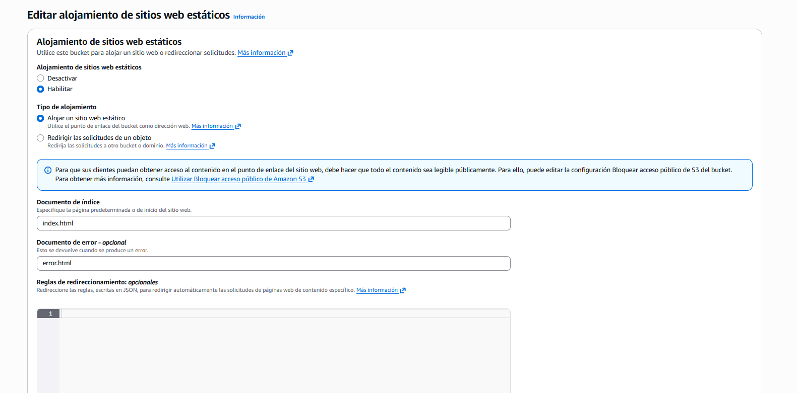

Tras guardar, S3 proporcionó el **endpoint público** del sitio:

```
http://website-bucket-1078fe90-5040.s3-website-us-east-1.amazonaws.com
```

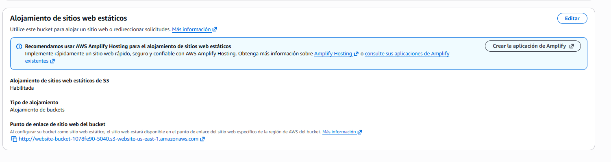

---

### 8. Verificación del sitio web

Al acceder al endpoint desde un navegador, se cargó correctamente el sitio **"Beach Wave Conditions"**, mostrando una tabla con las condiciones de olas por hora del día.

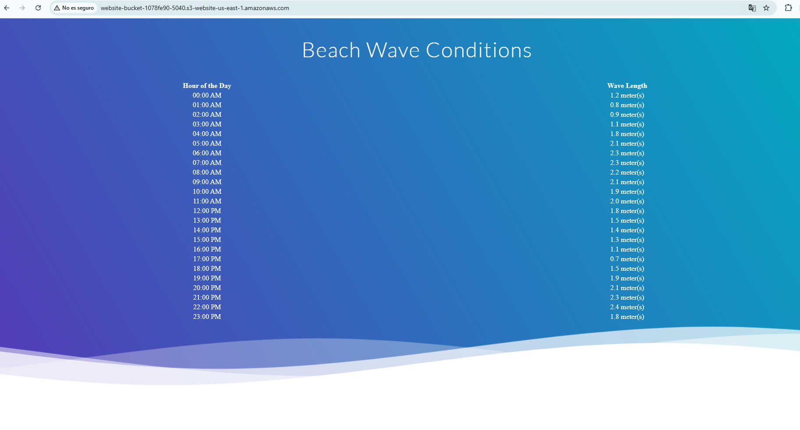

---

### 9. DIY — Renombrar `index.html` a `waves.html`

En la sección DIY del laboratorio, el objetivo era renombrar `index.html` a `waves.html` y actualizar la configuración del alojamiento estático.

**Paso 1:** Renombrar el objeto en el bucket.

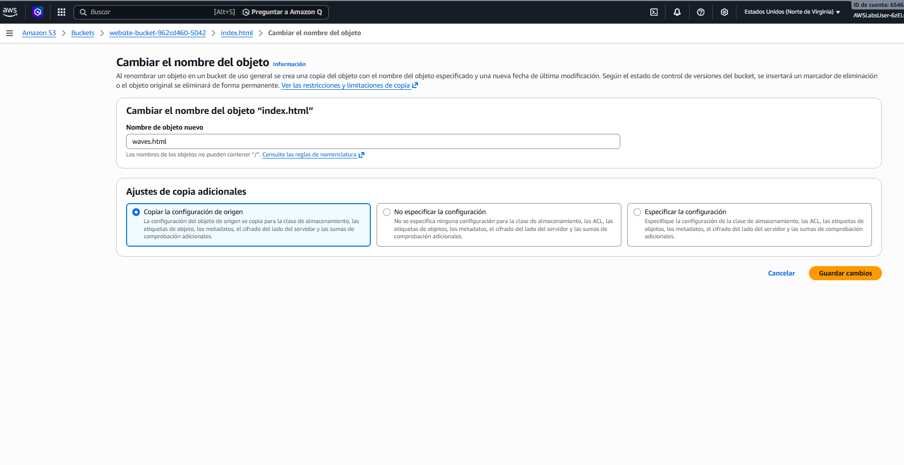

El rename fue exitoso:

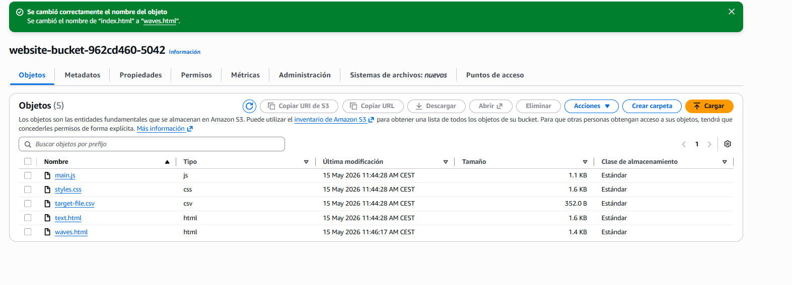

**Paso 2:** Actualizar el **Documento de índice** en la configuración de alojamiento estático a `waves.html`.

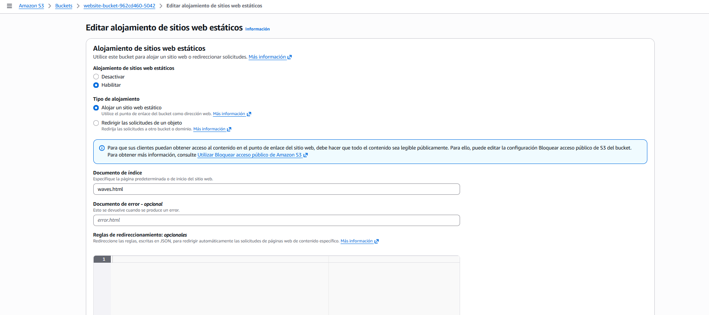
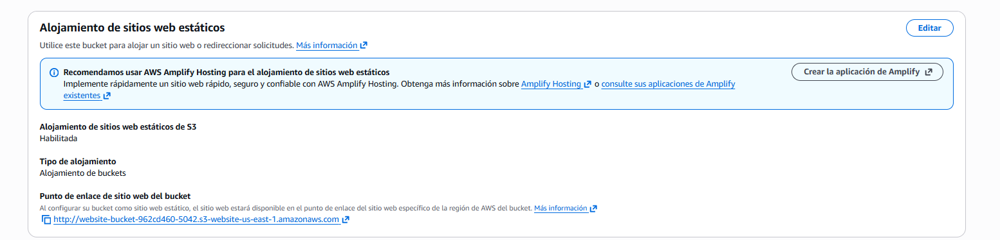


**Paso 3:** Validar en el laboratorio introduciendo el nombre del bucket.

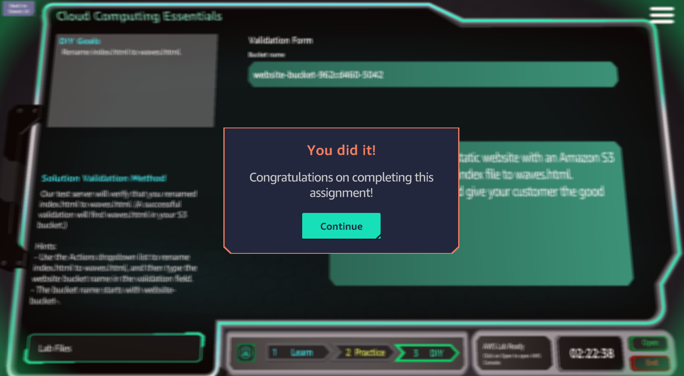
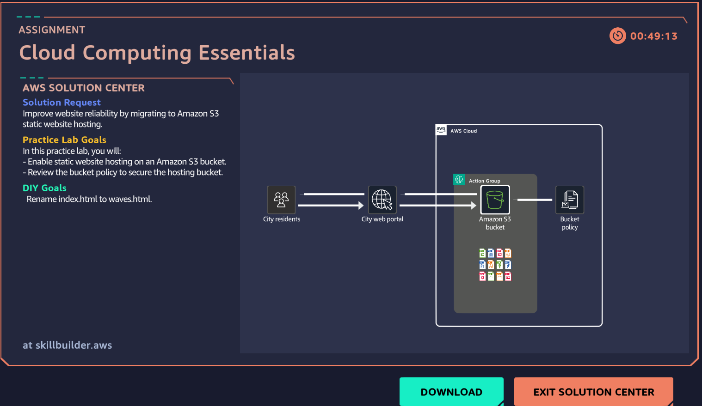


---

## Conceptos clave aprendidos

| Concepto | Descripción |
|---|---|
| **Amazon S3** | Servicio de almacenamiento de objetos escalable y de alta disponibilidad. |
| **Bucket policy** | Documento JSON que define permisos de acceso a nivel de bucket u objeto. |
| **Static website hosting** | Función de S3 que permite servir archivos HTML/CSS/JS directamente como sitio web. |
| **Block Public Access** | Configuración de seguridad que, cuando está activa, impide el acceso público. Debe desactivarse para sitios públicos. |
| **SSE-S3** | Cifrado del lado del servidor con claves administradas por AWS. |
| **Index document** | Archivo que S3 sirve cuando se accede a la raíz del bucket. |
| **Error document** | Archivo que S3 sirve cuando ocurre un error 4XX. |

---

## Reflexiones

Amazon S3 resulta ser una solución muy sencilla y económica para alojar sitios web estáticos. En minutos se puede tener un sitio web público sin necesidad de gestionar servidores ni infraestructura. Sin embargo, es importante:

- Revisar cuidadosamente la política del bucket para no exponer datos sensibles accidentalmente.
- Considerar usar **AWS CloudFront** junto a S3 para añadir HTTPS y mejorar el rendimiento mediante caché global.
- Para proyectos de mayor envergadura, AWS recomienda **AWS Amplify Hosting** como alternativa más completa.

---

## Referencias

- [Documentación oficial: S3 Static Website Hosting](https://docs.aws.amazon.com/AmazonS3/latest/userguide/WebsiteHosting.html)
- [AWS Skill Builder](https://skillbuilder.aws)
- [Bucket policies en S3](https://docs.aws.amazon.com/AmazonS3/latest/userguide/bucket-policies.html)

---

*WriteUp elaborado como parte del curso **Cloud Computing Essentials** en AWS Skill Builder.*
